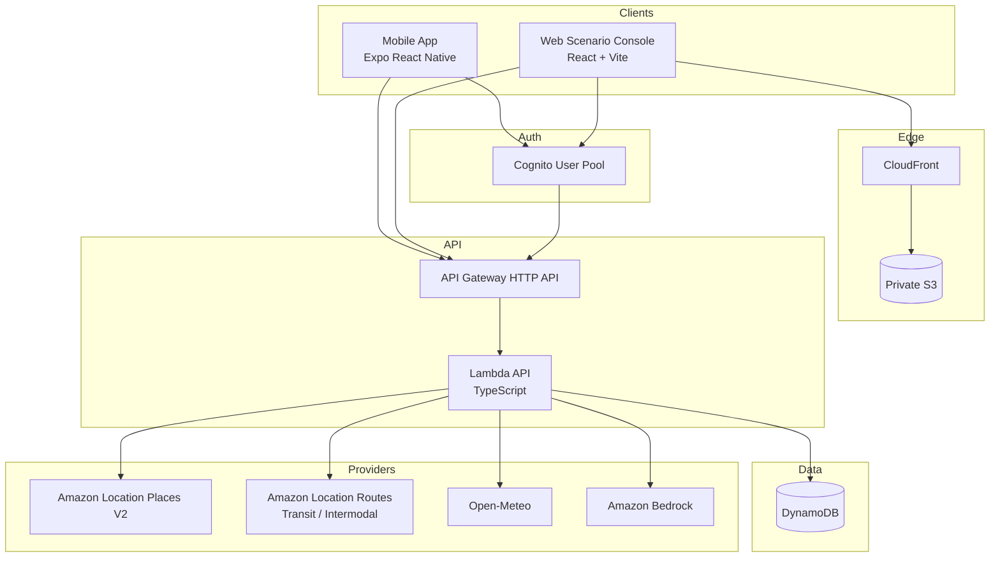
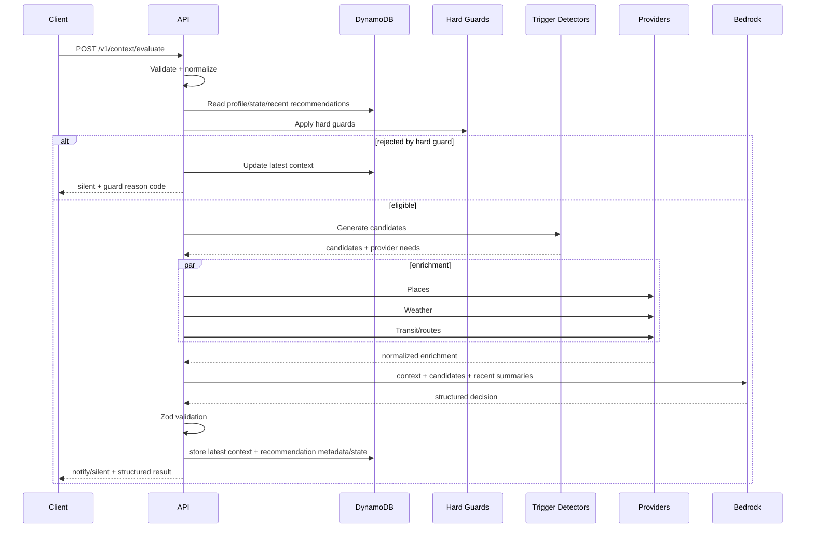

# ARCHITECTURE.md — System Architecture

## 1. Architectural goals

The architecture optimizes for:
- two-day hackathon shipping speed,
- a credible AWS story,
- replaceable external-data providers,
- deterministic testability,
- judge accessibility,
- privacy minimization,
- safe use of Bedrock,
- shared TypeScript contracts.

## 2. High-level architecture



## 3. Client architecture

### 3.1 Mobile

```text
Expo App
├── auth/
│   └── Cognito auth client
├── context/
│   ├── LocationSource
│   ├── CalendarSource
│   ├── StepSource
│   ├── ClockSource
│   └── ContextCollector
├── api/
│   └── BackendClient
├── notifications/
│   ├── LocalNotificationAdapter
│   └── DeviceTokenRegistration
├── screens/
│   ├── Dashboard
│   ├── RecommendationDetail
│   └── Settings
└── background/
    └── location/context tasks
```

Mobile should send normalized context to the backend rather than giving the backend direct access to the user's OS data.

#### Background location
Use Expo Location + TaskManager. Treat OS callbacks as opportunistic, not a guaranteed five-minute cron.

#### Calendar
Read several days locally and transmit only allowed fields.

#### Steps
Use a client-side `StepSource` interface:

```ts
interface StepSource {
  getTodaySteps(now: Date): Promise<{
    steps: number | null;
    confidence: "high" | "medium" | "low";
    source: string;
  }>;
}
```

Implementations:
- `IosPedometerStepSource`
- `AndroidHealthConnectStepSource`
- `ForegroundPedometerFallbackSource`
- `ScenarioStepSource` (web/tests)

Reason: Expo Pedometer's historical range method is iOS-only and its subscription does not deliver background updates on Android.

### 3.2 Web Scenario Console

```text
React/Vite
├── auth/
├── map/
│   ├── MapLibre
│   └── Amazon Location map style
├── scenario/
│   ├── LocationEditor
│   ├── ClockEditor
│   ├── StepsEditor
│   ├── CalendarEditor
│   └── PreferencesEditor
├── execution/
│   └── ScenarioApiClient
└── result/
    ├── RecommendationCards
    ├── UsedSignals
    ├── ProviderStatus
    └── DebugContext
```

The Scenario Console only supplies context. It cannot directly decide the answer.

## 4. Backend layering

Use explicit layers to prevent AWS/external clients from leaking into domain logic.

```text
handler
  ↓
application service
  ↓
domain
  ├── hard guards
  ├── detector registry
  ├── opportunity selection
  └── recommendation policy
  ↓
ports/interfaces
  ↓
adapters
  ├── DynamoDB
  ├── Amazon Location Places
  ├── Amazon Location Routes
  ├── Open-Meteo
  ├── Bedrock
  ├── Expo Push
  └── SNS
```

### 4.1 Suggested package boundaries

```text
apps/api/src/
├── handler.ts
├── routes/
├── application/
│   ├── evaluateContext.ts
│   ├── runScenario.ts
│   ├── getProfile.ts
│   └── chatWithRecommendation.ts
└── composition/
    └── createContainer.ts

packages/domain/src/
├── context/
├── guards/
├── triggers/
│   ├── upcomingEventTransit.ts
│   ├── stepGoalRest.ts
│   ├── freeTimeNearby.ts
│   ├── weatherAdaptation.ts
│   └── earlyArrivalDetour.ts
├── recommendation/
└── policies/

packages/providers/src/
├── ports/
│   ├── PlacesProvider.ts
│   ├── GeocodingProvider.ts
│   ├── WeatherProvider.ts
│   ├── RouteProvider.ts
│   ├── RecommendationModel.ts
│   ├── StateRepository.ts
│   └── NotificationProvider.ts
└── adapters/
    ├── amazonLocationPlaces.ts
    ├── amazonLocationGeocoding.ts
    ├── amazonLocationRoutes.ts
    ├── openMeteo.ts
    ├── bedrock.ts
    ├── dynamodb.ts
    ├── expoPush.ts
    └── snsPush.ts
```

## 5. Evaluation pipeline



## 6. Provider abstractions

### 6.1 Places

```ts
export interface PlacesProvider {
  searchNearby(input: {
    position: GeoPoint;
    radiusMeters: number;
    locale?: string;
    maxResults?: number;
    persistenceIntent: "single-use" | "storage";
  }): Promise<ProviderResult<Place[]>>;

  getPlace(input: {
    placeId: string;
    locale?: string;
    persistenceIntent: "single-use" | "storage";
  }): Promise<ProviderResult<Place>>;
}
```

MVP adapter:
`AmazonLocationPlacesProvider`.

Important:
- Use Places V2.
- Search without category restriction by default.
- Use category filters only when a detector has a strong reason.
- Candidate discovery is normally `SingleUse`.
- Before persisting a selected place, call `GetPlace(..., persistenceIntent: "storage")` and persist only normalized fields returned by that Storage-intent call.
- Do not persist raw provider response bodies.

### 6.2 Geocoding

```ts
export interface GeocodingProvider {
  geocode(input: {
    queryText: string;
    biasPosition?: GeoPoint;
    locale?: string;
    persistenceIntent: "single-use" | "storage";
  }): Promise<ProviderResult<GeocodedPlace[]>>;
}
```

MVP:
`AmazonLocationGeocodingProvider` using Places V2 `Geocode`.

### 6.3 Weather

```ts
export interface WeatherProvider {
  getWeather(input: {
    position: GeoPoint;
    at: string;
    timezone?: string;
  }): Promise<ProviderResult<WeatherSnapshot>>;
}
```

MVP:
`OpenMeteoWeatherProvider`.

### 6.4 Routes

```ts
export interface RouteProvider {
  getRoute(input: {
    origin: GeoPoint;
    destination: GeoPoint;
    mode: "transit" | "intermodal" | "pedestrian";
    departAt?: string;
    arriveBy?: string;
  }): Promise<ProviderResult<RouteSummary>>;
}
```

MVP:
`AmazonLocationRouteProvider`.

Transit coverage is data-provider-dependent. `unavailable` is a valid result.

### 6.5 Bedrock model

```ts
export interface RecommendationModel {
  decide(input: RecommendationModelInput): Promise<ModelDecision>;
  followUp(input: RecommendationFollowUpInput): Promise<ChatReply>;
}
```

Model ID must come from environment configuration:
`BEDROCK_MODEL_ID`.

Prefer Bedrock Converse Structured Outputs when model support is available.

### 6.6 Notifications

```ts
export interface RemoteNotificationProvider {
  send(input: NotificationMessage): Promise<NotificationSendResult>;
}
```

Adapters:
- Expo Push
- SNS

Local notifications are a mobile concern, not a backend adapter.

## 7. Data enrichment strategy

Avoid fetching every provider for every request.

Each detector declares needs:

```ts
type ProviderNeed =
  | "geocode-event-location"
  | "places-near-current"
  | "places-near-destination"
  | "weather-current"
  | "weather-today"
  | "route-to-next-event"
  | "route-to-place-candidates";
```

The application service:
1. unions the needs of viable candidates,
2. deduplicates calls,
3. executes independent providers in parallel,
4. respects dependencies (`geocode-event-location` before `route-to-next-event`; places before `route-to-place-candidates`),
5. applies per-provider timeout,
6. returns partial results if some providers fail.

Suggested provider timeout budget:
- Places: 2.5 s
- Weather: 2.0 s
- Routes: 3.0 s
- Bedrock: 7.0 s

Overall Lambda timeout: 15–20 s.

## 8. Trigger architecture

Detectors should not send notifications directly.

```ts
interface TriggerDetector {
  readonly type: TriggerType;
  detect(input: DetectorContext): Promise<CandidateOpportunity[]>;
}
```

Detector registry:

```ts
const detectors: TriggerDetector[] = [
  upcomingEventTransitDetector,
  stepGoalRestDetector,
  freeTimeNearbyDetector,
  weatherAdaptationDetector,
  earlyArrivalDetourDetector,
];
```

Adding a new scenario should normally mean:
1. add detector,
2. add tests/fixtures,
3. optionally add provider need,
4. no API contract change.

## 9. Hard-guard architecture

Hard guards are deterministic and cheap.

```ts
interface HardGuard {
  evaluate(input: GuardContext): GuardResult;
}
```

Delivery guard order:
1. request/context validation
2. user notification enabled
3. daily cap
4. duplicate context fingerprint
5. duplicate trigger/anchor window

Candidate minimum-signal/provider-coverage checks belong to detector/candidate filtering. `MISSING_REQUIRED_SIGNAL` must not globally suppress unrelated viable candidates.

In Scenario Console preview mode, delivery guards are evaluated for diagnostics (`wouldSuppress`) but do not consume counters or hide an otherwise useful recommendation.

Do not use an LLM to enforce absolute delivery limits.

## 10. AI design

### 10.1 Inputs
Bedrock receives only normalized data.

Example:
```json
{
  "userPreferences": {
    "interests": ["cafe", "museum"],
    "notificationFrequency": "normal"
  },
  "context": {
    "localTime": "2026-09-30T14:10:00+09:00",
    "position": {"latitude": 35.6812, "longitude": 139.7671},
    "stepsToday": 10432,
    "nextEvent": {
      "title": "Meeting",
      "startAt": "2026-09-30T16:00:00+09:00",
      "location": "Tokyo Station"
    }
  },
  "candidates": [],
  "places": [],
  "weather": {},
  "routes": [],
  "recentRecommendationSummaries": []
}
```

### 10.2 Outputs
Never require or store chain-of-thought.

Use:
- decision
- concise decision reason
- user message
- recommendations
- signals used

### 10.3 Model portability
No domain code imports a model-specific SDK type. Only the Bedrock adapter knows the selected model.

## 11. AWS architecture

### 11.1 API Gateway
Use HTTP API, not REST API, unless a missing required feature is discovered.

JWT authorizer:
- issuer: Cognito User Pool
- audience: client ID
- use access token/scopes where practical

Routes with no auth should be minimal, such as `/health`.

### 11.2 Lambda
Runtime: Node.js 24.x.

Use CDK `NodejsFunction` with esbuild.

Recommended:
- one API Lambda for hackathon simplicity,
- modular internal route/application code,
- split later only if scaling requires it.

### 11.3 DynamoDB
One table per environment.

Capacity:
- on-demand.

Features:
- TTL enabled on `expiresAt`.
- encryption at rest default.
- PITR optional for prod; not required for hackathon unless trivial.

### 11.4 S3 + CloudFront
Scenario Console:
- S3 bucket: private
- public access blocked
- Object Ownership: bucket-owner-enforced
- CloudFront OAC
- HTTPS only
- SPA fallback to `index.html`
- compression enabled
- cache immutable hashed assets aggressively
- `index.html` short cache

### 11.5 MapLibre + Amazon Location Maps
Use an Amazon Location API key restricted to:
- required `geo-maps` actions only
- prod CloudFront/custom-domain referrer
- dev domain/referrer separately
- expiration date

Do not use this browser key for server-side Places/Routes calls.

Server-side Places/Routes use Lambda IAM.

## 12. Authentication design

### Web/mobile authentication
Cognito Hosted UI or equivalent Authorization Code + PKCE flow.

Using Amplify Auth as a client SDK is acceptable; this does **not** imply Amplify Hosting.

### Demo account
- pre-create a dedicated judge/demo user.
- do not hardcode password in repository.
- publish credentials only through the approved submission mechanism.
- Scenario Console uses `deliveryMode=preview`, so multiple judges sharing the account do not consume daily notification quota or get blocked by duplicate-delivery guards.
- preview responses still expose `wouldSuppress` diagnostics.
- keep demo user's data isolated from normal users.

### Automated judge risk
The hackathon requires the application to be accessible to AI scoring and human judges. Before submission, verify whether the scoring system can complete the selected login flow.

Fallback if it cannot:
- keep normal user APIs Cognito-protected,
- add a **strictly limited public demo execution path** that uses only synthetic scenario data, rate limits, and no personal user data.
- only enable this fallback if needed for judging.

## 13. Environment architecture

Suggested default:
- application region: `ap-northeast-1`
- configurable `BEDROCK_REGION`
- configurable `BEDROCK_MODEL_ID`

Do not assume the selected model exists in the application region. Bedrock model/region support must be checked at deploy time.

Stack names:
```text
contextia-dev-core
contextia-prod-core
```

Phase 1 keeps the web hosting (private S3, CloudFront OAC, BucketDeployment) in the same `contextia-{stage}-core` stack as Cognito, the HTTP API and DynamoDB. A separate `-web` stack would create a cycle: the web client's callback URL needs the CloudFront domain, and `config.json` needs the API URL and the client ID.

CDK generates `/config.json` with `stage`, `buildId`, `apiBaseUrl` (without `/v1`), `auth.cognitoDomain`, `auth.clientId`, `auth.redirectUri`, `auth.scopes`, and `map.{region,styleName,apiKey}`. One web build serves both stages. The browser key permits only `geo-maps:GetTile` on the Region's provider/default, restricts referrers to that stage's CloudFront origin (plus localhost in dev), and requires an owner-supplied expiration. CloudFormation exposes the key name rather than its value, so a scoped DescribeKey custom resource obtains the public map key with response logging disabled. Map keys are retained on stack teardown; rotation/expiry is the owner's task. The hashed assets have immutable caching; `index.html` and `config.json` use `no-cache` and are invalidated on deployment. C must consume this runtime configuration; its UI integration is separate from D's infrastructure.

## 14. CI/CD architecture

### Pull Request validation / owner dev deployment
- checkout
- setup pnpm/node
- install with frozen lockfile
- lint
- typecheck
- unit tests
- build all
- `cdk synth`
- the owner starts the separate manual deploy workflow for the validated feature commit
- assume `GitHubDevDeployRole` via OIDC, deploy dev, run public smoke
- run authenticated scenario/ownership/idempotency smoke with two transient access tokens

Serialize dev deployment:
```yaml
concurrency:
  group: contextia-deploy-dev
  cancel-in-progress: false
```

### Main
- repeat validation
- project owner starts deployment from validated `main`
- assume `GitHubProdDeployRole`
- deploy prod
- smoke test public URL
- smoke test API
- optionally create GitHub deployment record

### IAM trust
Restrict GitHub OIDC role by:
- repository
- organization/owner
- branch/environment where possible

Prod role must not be assumable from arbitrary feature branches.

## 15. Coding agent → AWS connection

Use AWS Agent Toolkit / AWS MCP Server.

Codex:
```bash
codex mcp add aws-mcp --url https://aws-mcp.us-east-1.api.aws/mcp?oauth=initialize
```

Claude Code:
```bash
claude mcp add aws-mcp https://aws-mcp.us-east-1.api.aws/mcp --transport http
```

Agent IAM policy must be least privilege.

Evidence:
- screenshot/config proof of connection,
- development log showing agent used AWS tools,
- CloudTrail event screenshot/export if helpful.

CloudTrail records authenticated AWS MCP API calls, making it useful as audit proof.

## 16. Logging and metrics

Use JSON logs.

Do log:
- requestId
- user pseudonymous ID/hash
- source mode (`real`/`simulation`)
- detector types
- provider status
- latency
- decision
- recommendation ID
- error codes

Do **not** log:
- full calendar body
- exact long-term location history
- auth tokens
- notification tokens
- passwords
- full Bedrock prompts in production

Custom metrics:
- `EvaluationCount`
- `EvaluationLatencyMs`
- `BedrockInvocationCount`
- `NotifyCount`
- `SilentCount`
- `ProviderErrorCount` by provider
- `ProviderLatencyMs`
- `TriggerCandidateCount` by type
- `StructuredOutputValidationFailure`

## 17. Failure modes

| Failure | Behavior |
|---|---|
| Open-Meteo timeout | weather=`unavailable`; continue |
| Places timeout | no place cards; continue if another useful action exists |
| Transit unsupported | route=`unavailable`; never invent schedule |
| Bedrock timeout | return deterministic degraded result or `silent`; no fabricated AI message |
| DynamoDB unavailable | fail safely; do not send duplicate notification if state cannot be checked |
| Invalid client context | 400 with field errors |
| Expired token | 401 |
| Daily cap reached | `silent` with machine guard code |
| AI invalid JSON | validate → one repair attempt → graceful failure |

## 18. Cost controls

- Hard guard before Bedrock.
- Max 30 nearby place candidates before local filtering.
- Max 3 returned recommendations.
- No server cron that polls phones.
- API Gateway rate limits.
- Low CloudWatch retention in dev.
- Avoid storing raw provider payloads.
- Bedrock model configurable for cost/performance tradeoff.

## 19. Security boundary summary

```text
Browser public:
  CloudFront
  restricted Amazon Location map API key

Authenticated client:
  Cognito access token
  API Gateway

Server:
  Lambda execution role
  Places/Routes/Bedrock/DynamoDB permissions

CI:
  GitHub OIDC temporary role

Coding agents:
  AWS MCP + scoped IAM/OAuth
```
